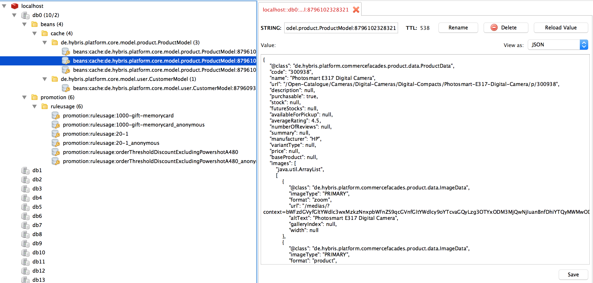

#Caching DTO beans with Spring cache and Redis

#Motivation
Hybris creates a lot of new DTO beans object every time when you access the storefront.
This impedes the responsive time and creates a lot of small short-live objects. 
This also gives the JVM high pressure to do the garbage collection.
You can consult the topic: converters and populators to get more info.

#Design
Caching the DTO beans in the Redis server.

#Implementation
##Install Redis

##Config spring cache
'''xml

    <bean id="jedisConnFactory" class="org.springframework.data.redis.connection.jedis.JedisConnectionFactory"
          p:usePool="true"/>

    <bean id="stringRedisSerializer" class="org.springframework.data.redis.serializer.StringRedisSerializer"/>
    <bean id="int2StringRedisSerializer" class="org.springframework.data.redis.serializer.GenericToStringSerializer"
          c:type="java.lang.Integer"/>
    <bean id="genericJackson2JsonRedisSerializer" class="org.springframework.data.redis.serializer.GenericJackson2JsonRedisSerializer"/>

    <bean id="redisTemplate" class="org.springframework.data.redis.core.RedisTemplate"
          p:connectionFactory-ref="jedisConnFactory"
          p:keySerializer-ref="stringRedisSerializer"
          p:hashKeySerializer-ref="stringRedisSerializer"
          p:valueSerializer-ref="genericJackson2JsonRedisSerializer"
          p:hashValueSerializer-ref="genericJackson2JsonRedisSerializer"/>

    <bean id="cacheManager" class="org.springframework.data.redis.cache.RedisCacheManager"
          c:redisOperations-ref="redisTemplate"
          p:defaultExpiration="600"
          p:usePrefix="true"/>

    <cache:advice id="cacheAdvice">
        <cache:caching cache="beans:cache">
            <cache:cacheable method="convert" key="#source.class.getName().concat(':').concat(#source.getPk().getLongValueAsString())"/>
        </cache:caching>
    </cache:advice>

    <aop:config>
        <aop:advisor advice-ref="cacheAdvice" pointcut="bean(customerConverter) || bean(productConverter)"/>
    </aop:config>
'''

#Verify

#Performance testing

#Next step

Winston Zhang

April 18, 2016
