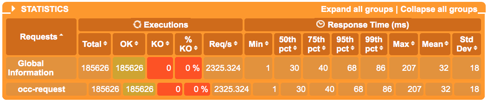
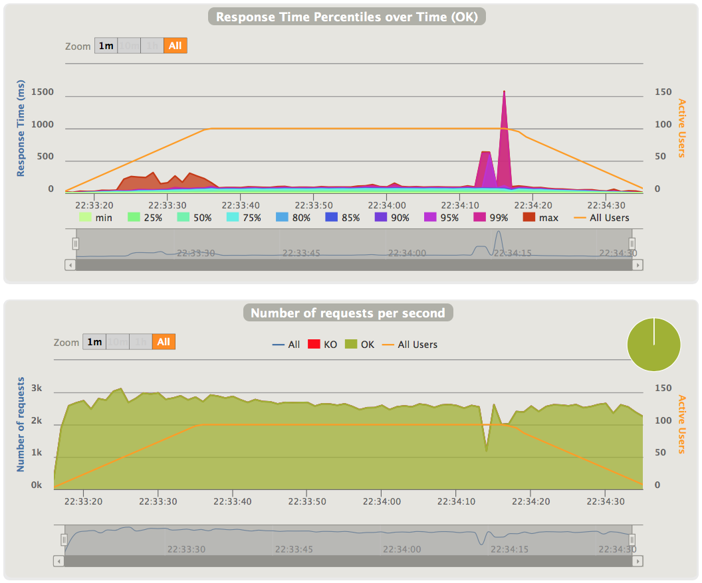
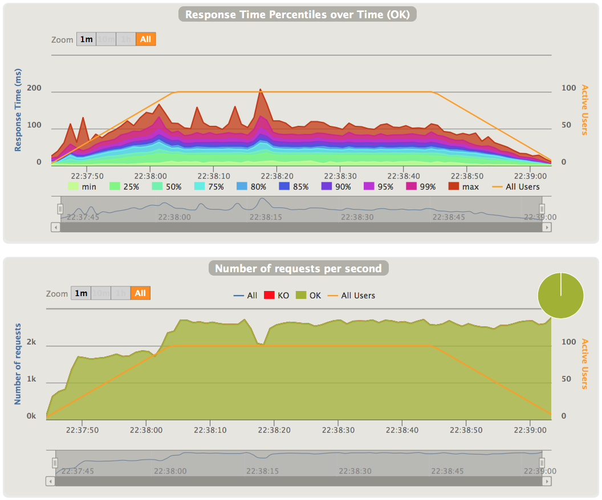
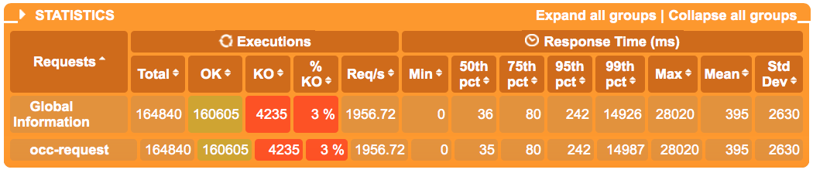
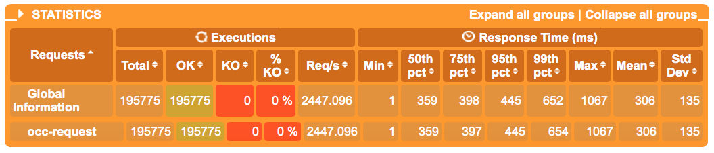
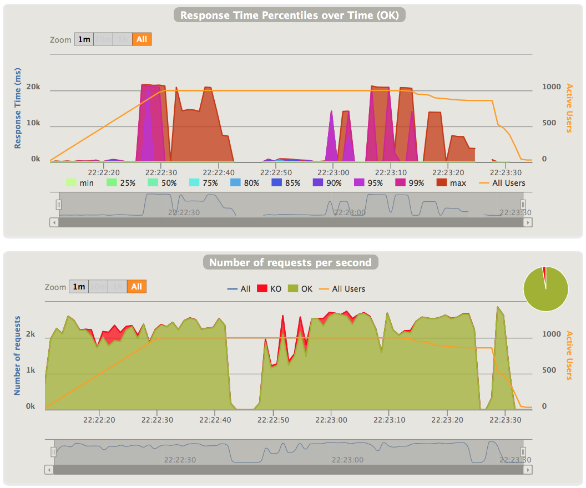
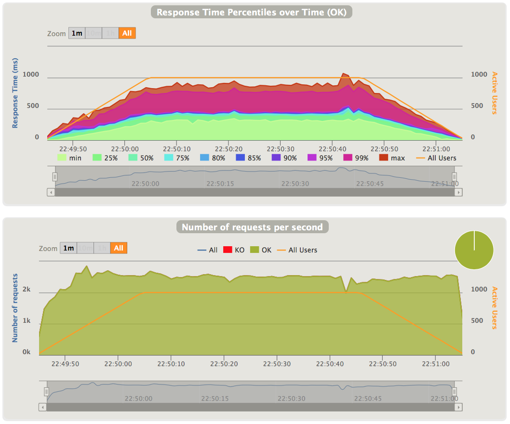

#Make hybris OCC API asynchronize with Netty

#Motivation
- high throughput
- high concurrency
- high scalability
- seperation of connection and business thread pool
- less resource utilization

#Environment
##Software
- SAP Hybris commerce suite 6.0 beta
- Netty 4.1 CR2
- Gatling 2.1

##Design

#Implementation

#Stress testing

Figure↑: Testing statistics/Spring MVC based OCC API/100 users

Figure↑: Testing statistics/Netty based OCC API/100 users

As you can see form these figures, default OCC API based on Spring MVC has slight better response time and tps under light load. but Netty based OCC API has less resource utilization.

Figure↑: Response time and TPS/Spring MVC based OCC API/100 users

Figure↑: Response time and TPS/Netty based OCC API/100 users

Figure↑: Testing statistics/Spring MVC based OCC API/1000 users

Figure↑: Testing statistics/Netty based OCC API/1000 users

As you can see form these figures, Netty base OCC API has better response time and tps than default OCC API under high load. Netty based OCC API still has less resource utilization than default OCC API.

There are some dropped connections for default Spring MVC based OCC API when have 500 more users. (Red part in tps figure)

Figure↑: Response time and TPS/Spring MVC based OCC API/1000 users

Figure↑: Response time and TPS/Netty based OCC API/1000 users

#Conclusion

#Open issues
- some logic is hard coded

#Next step
- Full funcational testing
- Move part of OAUTH2 logic to Nginx + Lua
- Modulize as an extension

#References
[Netty project](http://netty.io)

Winston Zhang (colorzhang@gmail.com)

Feburary 14, 2016
