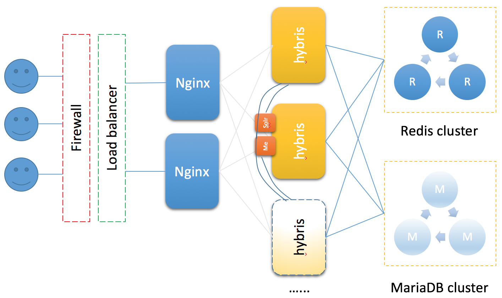
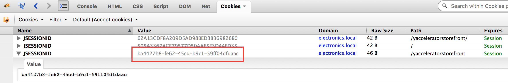
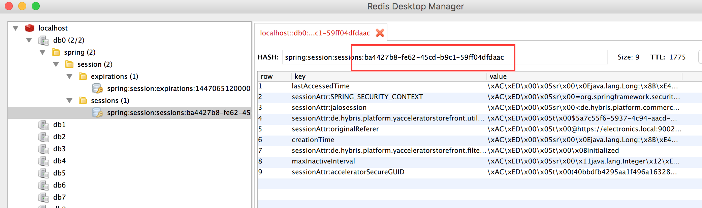
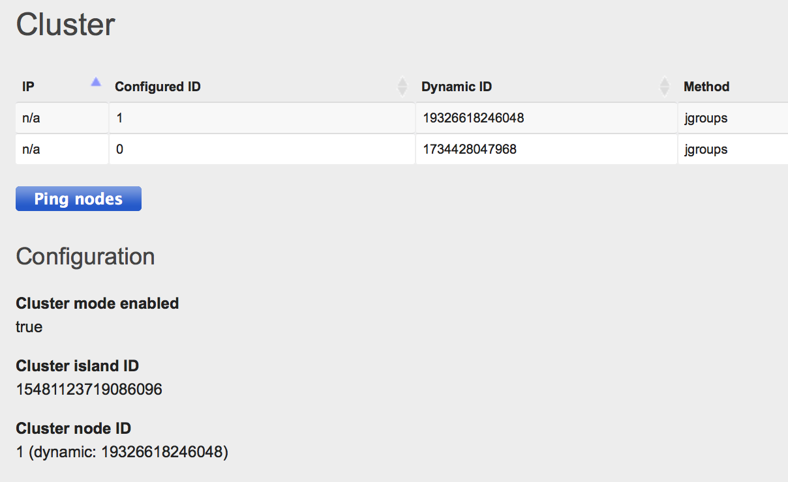

#Setup a multi-nodes hybris cluster with centralized session persistence on Redis

```
本文是大规模分布式电商系统系列文章之一，规划中文章有：
＊ 典型hybris电商应用架构
＊ 大规模互联网与电商应用扩展原则
＊ 应用层无状态化与服务化
＊ 数据层读写分离与分库分表
＊ 分布式搜索与SolrCloud
＊ hybris大规模可扩展架构推荐实践
如有任何问题请联系交流讨论，Winston Zhang (colorzhang@gmail.com)
```


:star::star::star:
29 May, 2016

Tested SAP Hybris Commerce 6.0 with Spring Session 1.2.0/Spring Data Redis 1.7.1/Spring Framework 4.2.6
- [x] Login/logout
- [x] Register
- [x] Shopping cart
- [x] Checkout
- [x] New promotion engine compability
- [x] Concurrent session control
- [ ] Failover
- [ ] Load balance
- [ ] Session sticky
- [ ] Redis cluster

```
[ I didn't post full source code here for this paper, please contact me if you have any question. ]
```

#Motivation
- Making hybris app stateless
- Higher scalability
- Centralized session persistence
- Load balance/failover
- Standalone Solr (start with one node)
- Media storage (in one node)

#Environment
##Software:
- Redis 3.0.5
- Spring Session 1.0.2
- hybris 5.7
- Nginx 1.8.0
- MariaDB 10.1.8

#Design

Simplified Architecture
- Share the Solr on one node (better to deploy seperately in production environment)
- Share media on one node (better to serve media with CDN or dedicate images server)

#Installation & Configuration
##Install redis
Redis install
```bash
brew install redis
redis-server /usr/local/etc/redis.conf
```

##Install hybris node01
```bash
# use b2c_acc_oms recipe
install.sh -r b2c_acc_oms
 
# local.properties
db.url=jdbc:mysql://localhost:3306/my1?useConfigs=maxPerformance&characterEncoding=utf8
db.driver=com.mysql.jdbc.Driver
db.username=hybris
db.password=hybris
db.customsessionsql=SET SESSION TRANSACTION ISOLATION LEVEL READ COMMITTED;

installed.tenants=
```

##Install hybris node02 (remove solrserver extension)
```bash
# local.properties
db.url=jdbc:mysql://localhost:3306/my1?useConfigs=maxPerformance&characterEncoding=utf8
db.driver=com.mysql.jdbc.Driver
db.username=hybris
db.password=hybris
db.customsessionsql=SET SESSION TRANSACTION ISOLATION LEVEL READ COMMITTED;
 
installed.tenants=
 
# media storage link to node01
media.replication.dirs=/Users/i306724/Downloads/commerce-suite-5.7.0.0.3467/hybris/data/media
media.read.dir=/Users/i306724/Downloads/commerce-suite-5.7.0.0.3467/hybris/data/media
media.electronics.http=http://electronics.local:9101
media.electronics.https=http://electronics.local:9102
 
tomcat.jmx.port=9103
tomcat.jmx.server.port=9104
tomcat.http.port=9101
tomcat.ssl.port=9102
os.rmiregistry.port=2298
```

##Configure Spring Session on both nodes
1) add related jars to platform/ext/core/lib and modify some classes

2) config hybris

*web/webroot/WEB-INF/config/spring-session.xml*
```xml
<?xml version="1.0" encoding="UTF-8"?>
<beans xmlns="http://www.springframework.org/schema/beans"
   xmlns:xsi="http://www.w3.org/2001/XMLSchema-instance"
   xmlns:context="http://www.springframework.org/schema/context"
   xmlns:p="http://www.springframework.org/schema/p"
   xsi:schemaLocation="http://www.springframework.org/schema/beans http://www.springframework.org/schema/beans/spring-beans.xsd
      http://www.springframework.org/schema/context http://www.springframework.org/schema/context/spring-context.xsd">
 
   <!-- tag::beans[] -->
 
   <!--1-->
   <context:annotation-config/>
   <bean class="org.springframework.session.data.redis.config.annotation.web.http.RedisHttpSessionConfiguration"/>
 
   <!--2-->
   <bean class="org.springframework.data.redis.connection.jedis.JedisConnectionFactory"/>
   <!-- end::beans[] -->
</beans>
```

*web/webroot/WEB-INF/config/web-application-config.xml*
```bash
...
<import resource="spring-session.xml"/>
...
```

*web/webroot/WEB-INF/web.xml*
```bash
...
<filter>
    <filter-name>springSessionRepositoryFilter</filter-name>
    <filter-class>org.springframework.web.filter.DelegatingFilterProxy</filter-class>
</filter>
<filter-mapping>
    <filter-name>springSessionRepositoryFilter</filter-name>
    <url-pattern>/*</url-pattern>
</filter-mapping>
...
```

##Install Nginx
```bash
brew install nginx
 
# generate ssl cert
openssl req -x509 -nodes -days 365 -newkey rsa:2048 -keyout ssl/nginx.key -out ssl/nginx.crt
 
# config nginx as load balancer
upstream hybris {
        server electronics.local:9001;
        server electronics.local:9101;
    }
     
    server {
        listen 80;
        server_name electronics.local;
        location /yacceleratorstorefront {
            proxy_pass http://hybris;
        }
        location /medias {
            proxy_pass http://hybris/medias;
        }
        proxy_set_header Host $host;
        proxy_set_header X-Real-IP $remote_addr;
    }
 
##############################################
### TODO ssl termination
##############################################
    upstream hybris-ssl {
        server electronics.local:9002;
        server electronics.local:9102;
    }
    server {
        listen 443 ssl;
        server_name electronics.local;
        ssl_certificate ssl/cert.crt;
        ssl_certificate_key ssl/cert.key;
        location /yacceleratorstorefront {
            proxy_pass https://hybris-ssl;
        }
        location /medias {
            proxy_pass https://hybris-ssl/medias;
        }
        proxy_set_header Host $host;
        proxy_set_header X-Real-IP $remote_addr;
        proxy_set_header X-Forwarded-For $proxy_add_x_forwarded_for;
        proxy_set_header X-Forwarded-Proto https;
        proxy_redirect off;
    }
```

##Configure hybris cluster
```bash
# local.properties
# cluster id auto discovery
clustermode=true
cluster.nodes.autodiscovery=true
cluster.broadcast.methods=jgroups
 
cluster.broadcast.method.jgroups=de.hybris.platform.cluster.jgroups.JGroupsBroadcastMethod
#cluster.broadcast.method.jgroups.tcp.bind_addr=127.0.0.1
#cluster.broadcast.method.jgroups.tcp.bind_port=7800
cluster.broadcast.method.jgroups.channel.name=hybris-broadcast
cluster.broadcast.method.jgroups.configuration=jgroups-udp.xml
 
### add -Djava.net.preferIPv4Stack=true to tomcat.generaloptions
```

#Testing & Verify
1) Access https://electronics.local:9002/yacceleratorstorefront/my-account & login

2) Access https://electronics.local:9102/yacceleratorstorefront/my-account you will get the same session


3) Access https://electronics.local/yacceleratorstorefront/my-account
- check session sticky / non-session sticky config
- shutdown one node(current session node) to test the failover

4) Check session stored in Redis


5) Check cluster status


#Open issues

#Next step
* Performance testing
* Redis cluster setup
* Docker deployment

#References
[Spring Session project](http://projects.spring.io/spring-session/)

[Next Generation Session Management with Spring Session](http://www.infoq.com/articles/Next-Generation-Session-Management-with-Spring-Session)

Winston Zhang (colorzhang@gmail.com)

November 11, 2015
